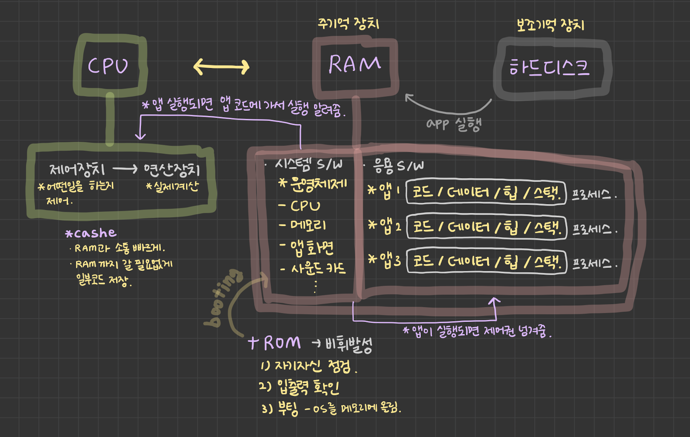

# 02_CPU와 메모리의 동작, 프로그래밍 언어

생성일: 2022년 10월 17일 오후 10:32
태그: CS 101

1. CPU의 내부에는 제어장치와 연산장치가 있다.
   1. CPU 내부에서 기억해야할 내용들을 저장하기 위해 레지스터(메모리의 일종)를 사용한다.
2. CPU의 제어장치는 명령어가 한줄한줄 실행되도록 모든 것을 통제한다.
   1. 연산이 필요한 경우는 연산장치로 보내서, 계산을 실행한다.
3. 운영체제는 PC의 하드웨어/소프트웨어의 모든 내용을 통제하고 관리한다.
4. 현재 실행되는 앱(프로세스)당 코-데-힙-스의 메모리 영역이 각각 따로 할당된다.
5. 프로그래밍 언어는 인간이 보다 쉽게 사용(논리적인 생각을 구현)할 수 있는 형태로 발전되어 왔다.
   1. 기계어 - 어셈블리어 - C언어

