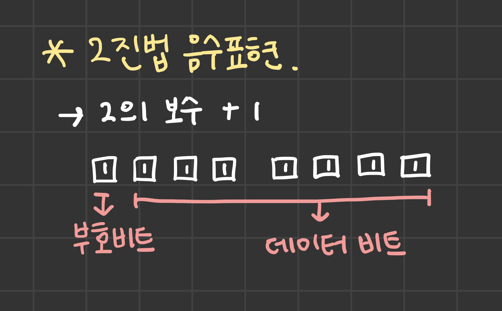

# 04\_메모리에서 음수의 표현 방법

생성일: 2022년 10월 22일 오후 2:00
태그: CS 101

1. 메모리의 비트에서 음수를 표현하기 위해서, 최상위비트(MSB)를 부호비트(Sign Bit)로 사용한다.
2. 음수를 표현하는 방법은 원래의 양수에 단순히 마이너스를 붙인 형태가 아니다.
   1. 2의 보수 방식을 사용해서 음수를 표현한다.
3. 2의 보수 방식은 양수와 음수를 더했을때, 0이 나오는 숫자를 찾는 방법과 같다.
   1. 2의 보수 방식을 이용해야 컴퓨터는 덧셈을 보다 빨리 계산할 수 있게 된다.

