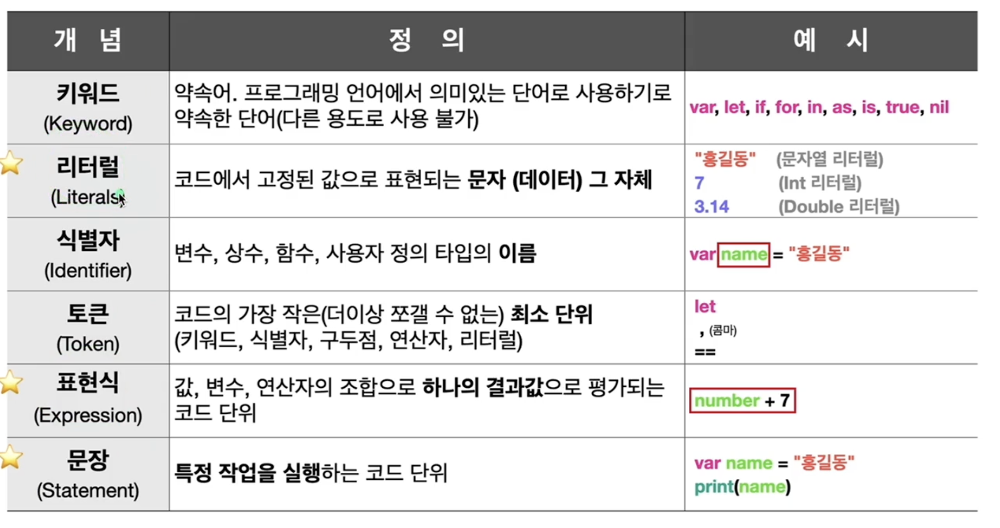

# 12\_기초용어정리

생성일: 2023년 5월 3일 오후 3:25
태그: part1



### 표현식

- 하나의 값이 나오는 코드이다.
- 표현식 하나로는 특정작업을 실행할 수 없음

```swift
var n = 5 // =====> 문장(할당하는 작업)

17       // 17
n        // 5
n + 7    // 12
n < 5    // false
```

### 문장

- 토큰(키워드) + 표현식(값)으로 이루어져있음

```swift
var n2 = 3
print(n)
print("안녕")
```
